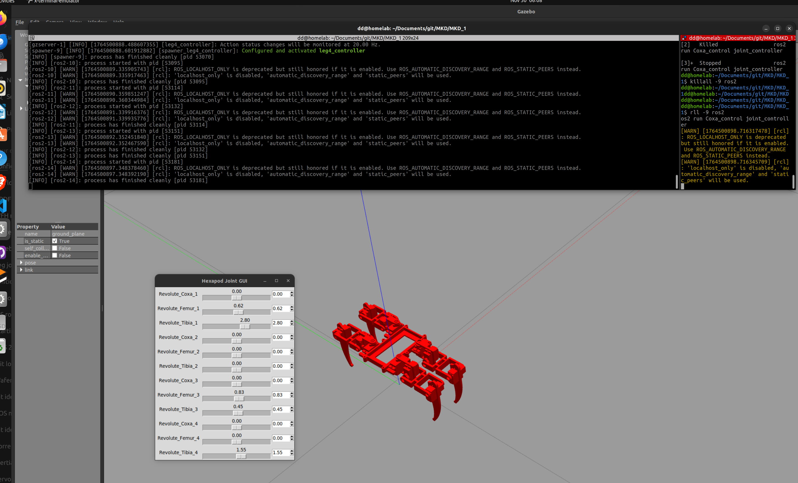

# MKD
 
```sudo apt update
sudo apt install ros-rolling-gazebo-ros \
                 ros-rolling-ros2-control \
                 ros-rolling-ros2-controllers \
                 ros-rolling-joint-state-publisher-gui \
                 ros-rolling-xacro

```

```
cd MKD
colcon build --symlink-install
source install/setup.bash
ros2 launch Assm_description gazebo.launch.py 
```

